# Data Mapping

## Data Mapping — Hive to BigQuery Physical Schema (100 Tables + 15 Views)

### Dataset Layout
```
BigQuery Project
├── staging        (45 tables) — raw landing, epochs as INT64
├── ods            (30 tables) — cleansed TIMESTAMPs, native BQ tables
├── dm             (25 tables + 15 views) — dims, facts, aggs
└── _etl_control   (3 tables) — watermarks, dq_results, job_audit
```

### Scalar Type Mapping (Applied to All 100 Tables)

| Hive Type | BigQuery Type | Column Count |
|-----------|--------------|-------------|
| BIGINT | INT64 | ~180 |
| INT / SMALLINT / TINYINT | INT64 | ~60 |
| STRING | STRING | ~200 |
| FLOAT | FLOAT64 | 0 |
| DOUBLE | FLOAT64 | 2 (sentiment_score, silence_pct) |
| BOOLEAN | BOOL | ~30 |
| TIMESTAMP | TIMESTAMP | ~60 (ODS/DM layers) |
| DATE | DATE | 0 source, added as synthetic partition cols |
| BINARY | BYTES | 0 |

### DECIMAL Precision Mapping (52 Columns, 7 Distinct Pairs)

| Hive DECIMAL | BigQuery NUMERIC | Tables |
|-------------|-----------------|--------|
| DECIMAL(14,2) | NUMERIC(14,2) | stg_fin_invoice.total_amount, fact_billing_line.line_amount, agg_program_monthly.billed_amount, agg_billing_monthly.billed_amount/net_revenue |
| DECIMAL(12,4) | NUMERIC(12,4) | stg_crm_contract_line.unit_rate, ods_contract_line.unit_rate, ods_rate_card.rate, stg_fin_invoice_line.unit_rate, fact_billing_line.unit_rate, etc. |
| DECIMAL(12,2) | NUMERIC(12,2) | stg_crm_contract_line.min_commit, stg_file_telco_invoice.charge_amount, ods_payroll_adjustment.amount, stg_fin_invoice_line.qty, fact_billing_line.qty, agg_billing_monthly.sla_credit_amount/telco_cost_amount, etc. |
| DECIMAL(10,4) | NUMERIC(10,4) | stg_crm_sla_target.target_value |
| DECIMAL(8,2) | NUMERIC(8,2) | stg_wfm_forecast.required_fte, fact_queue_interval.avg_speed_answer_sec/avg_handle_sec, agg_agent_daily/weekly.avg_handle_seconds |
| DECIMAL(5,2) | NUMERIC(5,2) | stg_crm_sla_target.penalty_pct, stg_file_qa_forms.overall_pct, ods_qa_evaluation.overall_pct, fact_qa_evaluation.overall_pct, fact_adherence_daily.adherence_pct/occupancy_pct, agg_*.adherence_pct/occupancy_pct/avg_csat/sl_pct/pct_promoters/pct_detractors |
| DECIMAL(7,2) | NUMERIC(7,2) | agg_queue_hourly.volume_variance_pct |

### Complex Type Mapping (4 Columns)

| Table | Column | Hive Type | BigQuery Type |
|-------|--------|-----------|--------------|
| stg_file_qa_forms | sections | `ARRAY<STRUCT<section_code:STRING,max_points:INT,scored_points:INT>>` | `ARRAY<STRUCT<section_code STRING, max_points INT64, scored_points INT64>>` (INT→INT64 inside struct) |
| stg_file_chat_transcripts | messages | `ARRAY<STRUCT<sender:STRING,ts_ms:BIGINT,text:STRING>>` | `ARRAY<STRUCT<sender STRING, ts_ms INT64, text STRING>>` |
| stg_file_chat_transcripts | metadata | `MAP<STRING,STRING>` | `ARRAY<STRUCT<key STRING, value STRING>>` |
| stg_file_speech_analytics | keywords | `ARRAY<STRING>` | `ARRAY<STRING>` (REPEATED STRING) |

### Partition Conversion Rules

#### Staging — Sqoop Mirrors (27 tables)
| Source Partition | Target | Example |
|-----------------|--------|---------|
| `load_date STRING` | `PARTITION BY load_date` as `DATE` | stg_crm_client, stg_hr_agent, etc. |
| Exception: `stg_wfm_schedule` has `(load_date STRING, site_code STRING)` | `PARTITION BY load_date DATE`, `CLUSTER BY (site_code)` | Multi-col→single+cluster |
| `stg_tel_call` has `CLUSTERED BY (call_id) INTO 16 BUCKETS` | `CLUSTER BY (call_id)` (no BUCKETS) | Bucketing→clustering |

#### Staging — Delta Feeds (8 tables)
| Source Partition | Target |
|-----------------|--------|
| `extract_ts STRING` | `PARTITION BY extract_ts` as `DATE` |

#### Staging — File Feeds (10 tables)
| Source Partition | Target |
|-----------------|--------|
| `(client_code STRING, feed_date STRING)` | `PARTITION BY feed_date` as `DATE`, `CLUSTER BY (client_code)` |

#### ODS — Cleanse (15 tables)
| Source Partition | Target |
|-----------------|--------|
| `snapshot_date STRING` | `PARTITION BY snapshot_date` as `DATE` |
| `sched_date STRING` | `PARTITION BY sched_date` as `DATE` |
| `event_date STRING` | `PARTITION BY event_date` as `DATE` |
| `call_date STRING` | `PARTITION BY call_date` as `DATE` |

#### ODS — Delta-Merge (8 tables)
| Source Partition | Target |
|-----------------|--------|
| `work_month STRING` | `PARTITION BY work_month` as `DATE` (first of month) |
| `period_month STRING` | `PARTITION BY period_month` as `DATE` |
| `event_date STRING` | `PARTITION BY event_date` as `DATE` |
| `swap_month STRING` | `PARTITION BY swap_month` as `DATE` |
| `event_month STRING` | `PARTITION BY event_month` as `DATE` |
| `snapshot_date STRING` | `PARTITION BY snapshot_date` as `DATE` |

#### ODS — SCD-2 (3 tables)
| Source Partition | Target |
|-----------------|--------|
| `eff_from_year INT` | Add `eff_from_date DATE` derived from `eff_from_ts`, `PARTITION BY eff_from_date`. Keep `eff_from_year INT` as regular column. |

#### ODS — ACID (4 tables)
| Source | Target |
|--------|--------|
| `ods_client_acid`: `CLUSTERED BY (client_id) INTO 4 BUCKETS` | `CLUSTER BY (client_id)` — no partition |
| `ods_agent_acid`: `CLUSTERED BY (agent_id) INTO 8 BUCKETS` | `CLUSTER BY (agent_id)` |
| `ods_ticket_acid`: `CLUSTERED BY (ticket_id) INTO 8 BUCKETS` | `CLUSTER BY (ticket_id)` |
| `ods_invoice_acid`: `CLUSTERED BY (invoice_id) INTO 4 BUCKETS` | `CLUSTER BY (invoice_id)` |

#### DM — Dimensions (9 tables)
No partition, no cluster. `dim_date`, `dim_agent`, `dim_client`, `dim_program`, `dim_queue`, `dim_site`, `dim_shift`, `dim_org`, `dim_disposition` are all unpartitioned.

#### DM — Facts (9 tables)
| Table | Source Partition | Target Partition | Target Cluster |
|-------|-----------------|-----------------|---------------|
| fact_interaction | `(date_key INT, channel STRING)` + `CLUSTERED BY (agent_sk) INTO 16 BUCKETS` | `PARTITION BY _partition_date` (DATE) | `CLUSTER BY (channel, agent_sk)` |
| fact_agent_activity | `date_key INT` | `PARTITION BY _partition_date` | none |
| fact_queue_interval | `date_key INT` | `PARTITION BY _partition_date` | none |
| fact_csat_survey | `date_key INT` | `PARTITION BY _partition_date` | none |
| fact_qa_evaluation | `date_key INT` | `PARTITION BY _partition_date` | none |
| fact_billing_line | `period_month STRING` | `PARTITION BY _partition_date` (DATE from period_month) | none |
| fact_adherence_daily | `date_key INT` | `PARTITION BY _partition_date` | none |
| fact_ticket | `date_key INT` | `PARTITION BY _partition_date` | none |
| fact_ivr_path | `date_key INT` | `PARTITION BY _partition_date` | none |

#### DM — Aggregates (7 tables)
| Table | Source Partition | Target Partition |
|-------|-----------------|-----------------|
| agg_agent_daily | `date_key INT` | `PARTITION BY _partition_date` |
| agg_agent_weekly | `week_start_key INT` | `PARTITION BY _partition_date` |
| agg_program_monthly | `period_month STRING` | `PARTITION BY _partition_date` |
| agg_queue_hourly | `date_key INT` | `PARTITION BY _partition_date` |
| agg_csat_rollup_monthly | `period_month STRING` | `PARTITION BY _partition_date` |
| agg_billing_monthly | `period_month STRING` | `PARTITION BY _partition_date` |
| agg_site_daily | `date_key INT` | `PARTITION BY _partition_date` |

### Staging Partition Expiration
All 45 staging tables: `OPTIONS(partition_expiration_days=90)` — prevents partition sprawl per locked Performance decision.

### Column Description Preservation
- All epoch BIGINT columns in staging carry descriptions: `epoch SECONDS` or `epoch MILLISECONDS`
- `stg_fin_invoice.issued_ts_sec` and `due_ts_sec` carry: `!! name says seconds, VALUES ARE MILLIS !!`
- Source Hive COMMENTs → BigQuery column `OPTIONS(description=...)`

### DM Star Schema (ER Diagram)

```mermaid
erDiagram
    dim_date {
        INT64 date_key PK
        STRING full_date
    }
    dim_agent {
        INT64 agent_sk PK
        INT64 agent_id
    }
    dim_client {
        INT64 client_sk PK
        INT64 client_id
    }
    dim_program {
        INT64 program_sk PK
        INT64 program_id
        INT64 client_id FK
    }
    dim_queue {
        INT64 queue_sk PK
        INT64 queue_id
        INT64 program_id FK
    }
    dim_site {
        INT64 site_sk PK
        STRING site_code
    }
    dim_shift {
        INT64 shift_sk PK
        INT64 shift_id
    }
    dim_org {
        INT64 org_sk PK
        INT64 org_unit_id
    }
    dim_disposition {
        INT64 disposition_sk PK
        STRING disposition_code
    }
    fact_interaction {
        STRING interaction_id PK
        INT64 client_sk FK
        INT64 program_sk FK
        INT64 queue_sk FK
        INT64 agent_sk FK
        INT64 date_key FK
        DATE _partition_date "partition column"
        STRING channel
    }
    fact_agent_activity {
        INT64 agent_sk FK
        INT64 date_key FK
        DATE _partition_date "partition column"
    }
    fact_queue_interval {
        INT64 queue_sk FK
        INT64 date_key FK
        DATE _partition_date "partition column"
    }
    fact_csat_survey {
        STRING survey_id PK
        INT64 client_sk FK
        INT64 program_sk FK
        INT64 agent_sk FK
        INT64 date_key FK
        DATE _partition_date "partition column"
    }
    fact_qa_evaluation {
        STRING qa_form_id PK
        INT64 agent_sk FK
        INT64 program_sk FK
        INT64 date_key FK
        DATE _partition_date "partition column"
    }
    fact_billing_line {
        INT64 invoice_line_id PK
        INT64 client_sk FK
        INT64 program_sk FK
        DATE _partition_date "partition column"
        STRING period_month
    }
    fact_adherence_daily {
        INT64 agent_sk FK
        INT64 date_key FK
        DATE _partition_date "partition column"
    }
    fact_ticket {
        INT64 ticket_id PK
        INT64 program_sk FK
        INT64 date_key FK
        DATE _partition_date "partition column"
    }
    fact_ivr_path {
        STRING session_ref PK
        INT64 date_key FK
        DATE _partition_date "partition column"
    }
    agg_agent_daily {
        INT64 agent_sk FK
        INT64 date_key FK
        DATE _partition_date "partition column"
    }
    agg_agent_weekly {
        INT64 agent_sk FK
        INT64 week_start_key
        DATE _partition_date "partition column"
    }
    agg_program_monthly {
        INT64 client_sk FK
        INT64 program_sk FK
        DATE _partition_date "partition column"
        STRING period_month
    }
    agg_queue_hourly {
        INT64 queue_sk FK
        INT64 date_key FK
        DATE _partition_date "partition column"
    }
    agg_csat_rollup_monthly {
        INT64 client_sk FK
        INT64 program_sk FK
        DATE _partition_date "partition column"
        STRING period_month
    }
    agg_billing_monthly {
        INT64 client_sk FK
        INT64 program_sk FK
        DATE _partition_date "partition column"
        STRING period_month
    }
    agg_site_daily {
        STRING site_code
        INT64 date_key FK
        DATE _partition_date "partition column"
    }
    etl_watermarks {
        STRING source_table PK
        STRING last_value
        TIMESTAMP last_run_ts
    }
    etl_dq_results {
        STRING run_id
        DATE run_date "partition column"
        STRING check_name
        STRING status
    }
    etl_job_audit {
        STRING job_id PK
        STRING dag_id
        TIMESTAMP start_ts
        STRING status
    }
    dim_date ||--o{ fact_interaction : "date_key"
    dim_agent ||--o{ fact_interaction : "agent_sk"
    dim_client ||--o{ fact_interaction : "client_sk"
    dim_program ||--o{ fact_interaction : "program_sk"
    dim_queue ||--o{ fact_interaction : "queue_sk"
    dim_agent ||--o{ fact_agent_activity : "agent_sk"
    dim_date ||--o{ fact_agent_activity : "date_key"
    dim_queue ||--o{ fact_queue_interval : "queue_sk"
    dim_date ||--o{ fact_queue_interval : "date_key"
    dim_agent ||--o{ fact_csat_survey : "agent_sk"
    dim_program ||--o{ fact_csat_survey : "program_sk"
    dim_date ||--o{ fact_csat_survey : "date_key"
    dim_agent ||--o{ fact_qa_evaluation : "agent_sk"
    dim_program ||--o{ fact_qa_evaluation : "program_sk"
    dim_date ||--o{ fact_qa_evaluation : "date_key"
    dim_client ||--o{ fact_billing_line : "client_sk"
    dim_program ||--o{ fact_billing_line : "program_sk"
    dim_agent ||--o{ fact_adherence_daily : "agent_sk"
    dim_date ||--o{ fact_adherence_daily : "date_key"
    dim_program ||--o{ fact_ticket : "program_sk"
    dim_date ||--o{ fact_ticket : "date_key"
    dim_date ||--o{ fact_ivr_path : "date_key"
    dim_agent ||--o{ agg_agent_daily : "agent_sk"
    dim_date ||--o{ agg_agent_daily : "date_key"
    dim_date ||--o{ agg_site_daily : "date_key"
```



### Cross-Dataset FK→PK Type Consistency
All FK/PK join paths use consistent INT64 types:
- `staging.*.client_id INT64` ↔ `ods.ods_client_acid.client_id INT64` ↔ `dm.dim_client.client_id INT64`
- `dm.dim_*.* _sk INT64` ↔ `dm.fact_*.*_sk INT64` (surrogate keys)
- `dm.dim_program.program_id INT64` ↔ `ods.ods_program.program_id INT64`
- All integer FKs in source (BIGINT/INT) map to INT64 on both sides — no type mismatch possible.
